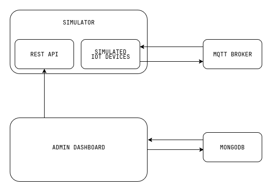

# mqttproject

## Project Idea
mqttproject is a simulation platform for testing IoT networks using MQTT. The project aims to provide a controlled environment for simulating multiple IoT devices.

It consists of two main components:
- [mqttproject](https://github.com/mqttproject/mqttproject): A simulator that mimics IoT devices communicating over MQTT.
- [adminDashboard](https://github.com/mqttproject/adminDashboard): A web-based control panel for managing the simulator through its REST API.

## Tech Stack Used
### mqttproject (Simulator)
- Go (Golang) – Used for the simulation logic due to its excellent support for concurrency, performance, and simplicity.
- Node.js – Hosts the MQTT broker using Aedes npm package.

### admindashboard (Control Panel)
- React – Frontend for the admin dashboard, providing a responsive and modern UI to control simulations.
- Node.js (Express) – Backend API server that communicates with the simulator and stores data.
- MongoDB – Used as the database to store simulators.
